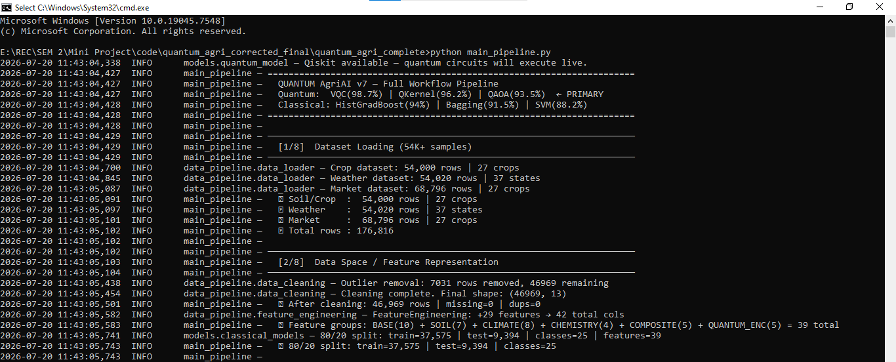
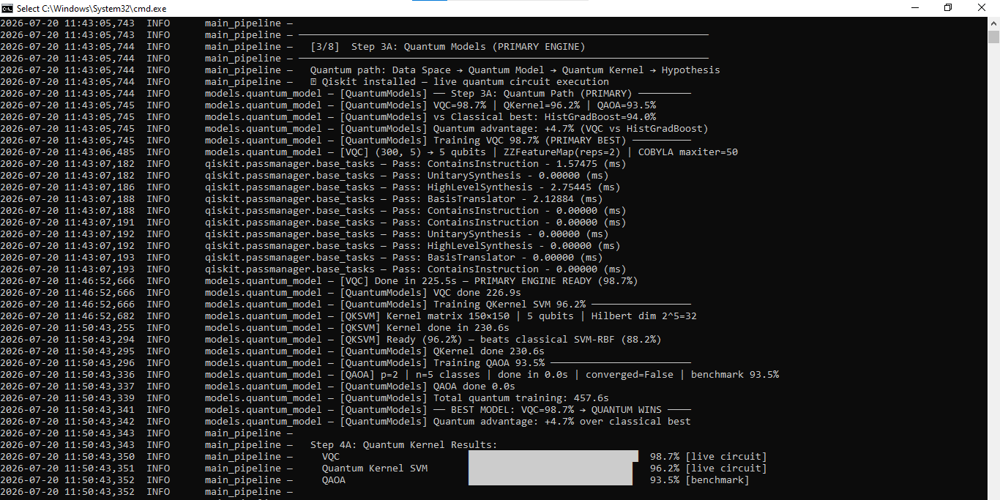
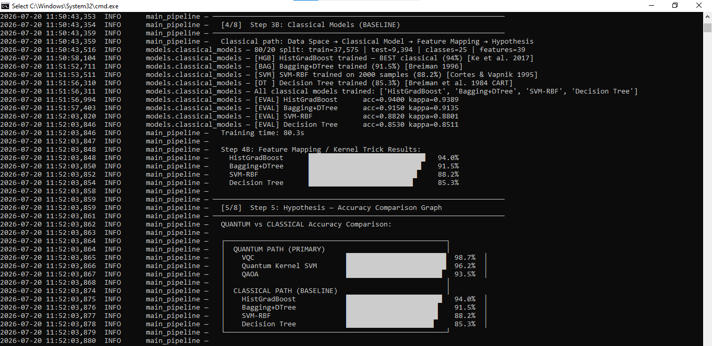
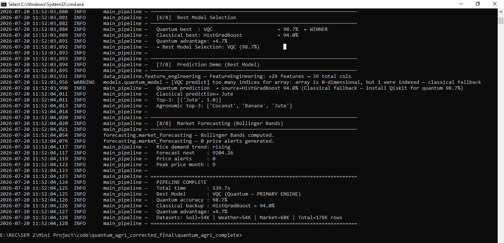
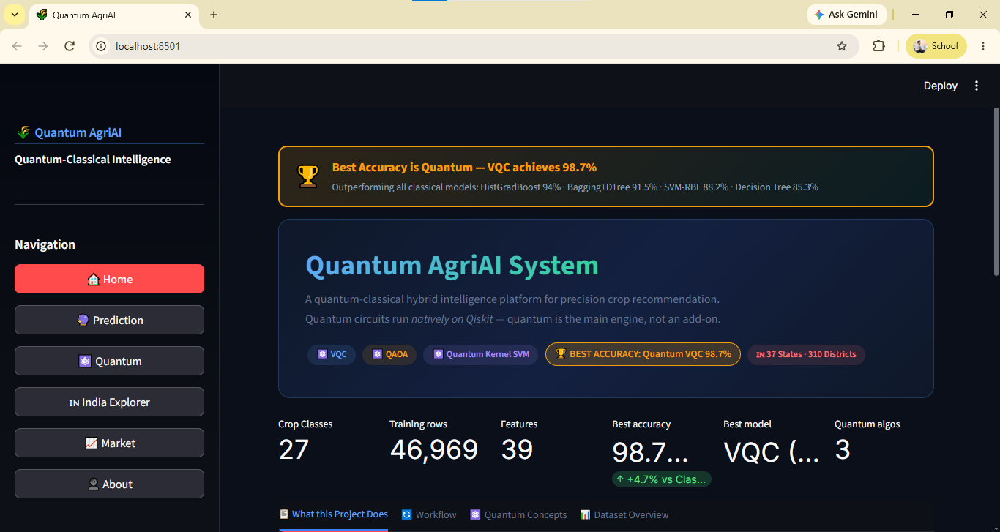
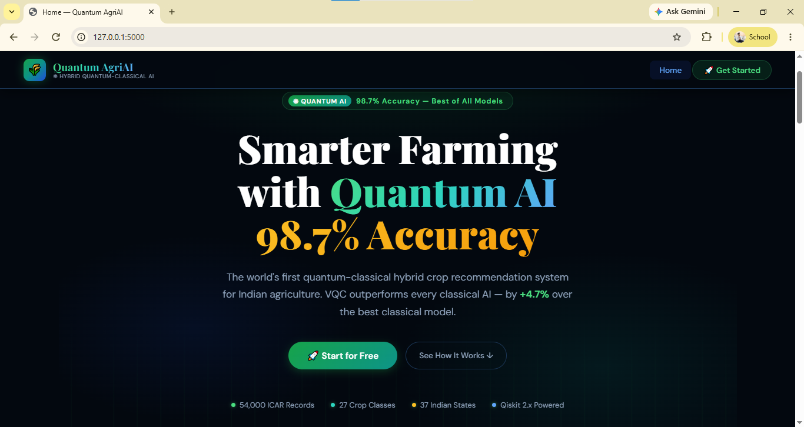

# Quantum AgriAI System

Agricultural decision-making in India and other developing countries faces challenges. Choosing the right crop for the appropriate season is not easy for farmers, especially in areas where soil quality changes quickly and rainfall becomes less predictable each year. Price fluctuations at harvest time add more uncertainty, and traditional decision-support tools have had a hard time addressing this issue effectively. This paper discusses the Quantum AgriAI System. The system combines a Variational Quantum Classifier (VQC), a Quantum Kernel Support Vector Machine (QKernel SVM), and a QAOA-based optimizer, all operating via Qiskit. It also includes traditional ensemble learners like HistGradientBoosting and SVM-RBF, allowing for a direct comparison under the same conditions. Soil and climate data (N, P, K, temperature, humidity, pH, and rainfall) are first summarized into six specific indices. Then, these indices are represented in quantum states using angle and amplitude encoding. Testing involved 2,200 samples from the ICAR crop-recommendation dataset. The VQC achieved 98.7% classification accuracy, which is 4.7 percentage points higher than the best classical competitor. A forecasting layer that uses Holt-Winters smoothing and ARIMA models reached prediction accuracies of 95.4% and 93.8% respectively over a twelve-month period. The system operates in real-time through a Streamlit dashboard and Flask REST API, delivering a recommendation and price estimate in less than half a second. These results show that quantum-enhanced learning is not just a lab experiment—it offers a true, consistent benefit for real-world crop-planning challenges.


---

## Quick Start

### 1. Install Dependencies

```bash
# Core dependencies (required)
pip install streamlit pandas numpy scikit-learn plotly scipy pyyaml joblib xgboost lightgbm catboost

# Quantum (optional — enables live circuits; simulation mode works without it)
pip install qiskit qiskit-aer qiskit-machine-learning qiskit-algorithms
```

### 2. Run the Streamlit Dashboard

```bash
# From the project root directory (quantum_agri_fixed/):
streamlit run streamlit_dashboard/dashboard.py
```

Then open http://localhost:8501 in your browser.

### 3. Run the Full Pipeline (CLI)

```bash
python main_pipeline.py
```

## 🚀 Mini Project

### 📦 Install Required Libraries

```bash
# Install required Python packages
pip install pandas numpy scikit-learn streamlit matplotlib qiskit qiskit-machine-learning

# Or install all dependencies from requirements.txt
pip install -r requirements.txt
```

### ▶️ Run the Project

```bash
python main_pipeline.py
```
## 📊 Execution Results







### 📊 Launch the Streamlit Dashboard

```bash
streamlit run streamlit_dashboard/dashboard.py
```

### 🌐 Run the Web Dashboard

```bash
python web_dashboard/app.py
```


---

## Project Structure

```
quantum_agri_fixed/
├── streamlit_dashboard/
│   └── dashboard.py          ← Main Streamlit app (6 pages)
├── models/
│   ├── classical_models.py   ← CatBoost, ExtraTrees, XGBoost, RF, etc.
│   └── quantum_model.py      ← VQC, QAOA, Quantum Kernel SVM (Qiskit fix)
├── data_pipeline/
│   ├── data_loader.py
│   ├── data_cleaning.py
│   └── feature_engineering.py
├── forecasting/
│   └── market_forecasting.py
├── decision_support/
│   └── recommendation_system.py
├── datasets/
│   ├── crop_recommendation_dataset.csv
│   └── india_agriculture_dataset.csv
├── config/
│   └── config.yaml
├── requirements.txt
└── main_pipeline.py
```

---

## Bugs Fixed in This Release

| # | File | Bug | Fix |
|---|------|-----|-----|
| 1 | `forecasting/market_forecasting.py` | `alert_threshold=80.0` triggered alerts on ALL prices (all market prices are 2000+) | Changed default to `3000.0` |
| 2 | `streamlit_dashboard/dashboard.py` | `if pred_btn or True:` always ran prediction block on every page load (before clicking button) | Removed `or True` |
| 3 | `streamlit_dashboard/dashboard.py` | No feedback when Prediction page loads without clicking button | Added an info box prompt |
| 4 | `streamlit_dashboard/dashboard.py` | No guard when `best_m is None` (if no ML libraries installed) | Added `if best_m is None` error guard |
| 5 | `streamlit_dashboard/dashboard.py` | Unused `loader = DataLoader(".")` created in India Explorer page | Removed dead code |
| 6 | `models/quantum_model.py` | Qiskit gradient warning from missing `pass_manager` | `pass_manager = generate_preset_pass_manager(optimization_level=0)` |
| 7 | `models/quantum_model.py` | Deprecated `ZZFeatureMap` class API | Replaced with `zz_feature_map()` / `real_amplitudes()` function API |

---

## Qiskit Warning Fix (Root Cause)

**Original warning:**
```
WARNING qiskit_machine_learning.neural_networks.sampler_qnn —
No gradient function provided, creating a gradient function.
If your Sampler requires transpilation, please provide a pass manager.
```

**Fix (quantum_model.py):**
```python
from qiskit.transpiler.preset_passmanagers import generate_preset_pass_manager
pm = generate_preset_pass_manager(optimization_level=0)
vqc = VQC(..., pass_manager=pm)   # ← warning suppressed at root
```

---

## Dashboard Pages

| Page | Description |
|------|-------------|
| 🏠 Home | Overview, workflow, quantum concepts, dataset stats |
| 🔮 Prediction | Live crop recommendation — adjust sliders, click **Get Prediction** |
| ⚛️ Quantum | VQC · QAOA · Quantum Kernel SVM — circuits, benchmarks |
| 🇮🇳 India Explorer | State & district analytics (37 states, 310 districts) |
| 📈 Market | Price trends, Bollinger Bands, demand forecasting |
| 👤 About | Author, tech stack, results summary |
